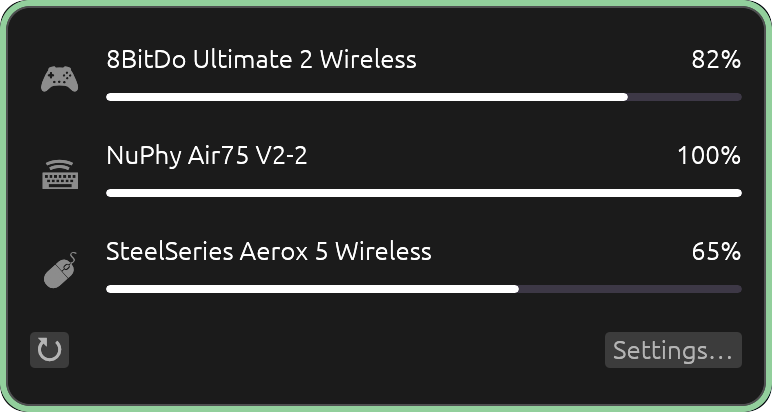
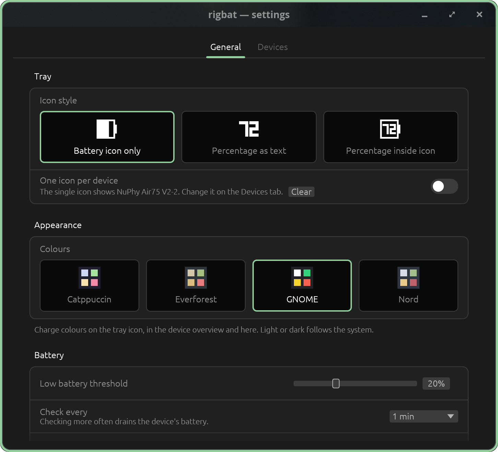
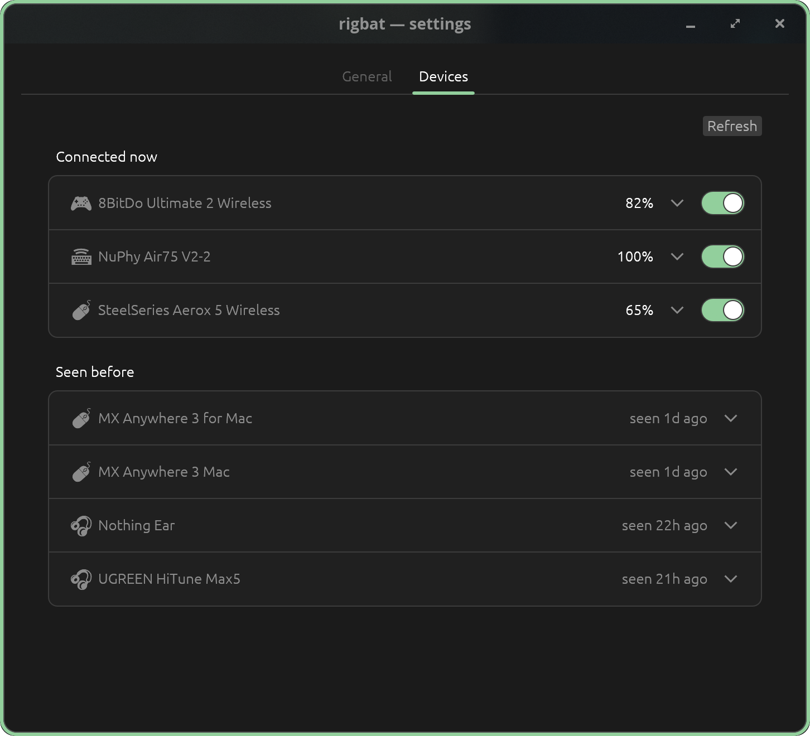

# rigbat

[](https://crates.io/crates/rigbat)
[](https://github.com/Skesov/rigbat/actions/workflows/ci.yml)
[](#license)

System tray battery monitor for gaming peripherals on Linux.

<p align="center">
  
</p>

## What it does

- Shows battery level of connected peripherals (mice, keyboards, headsets, controllers) in the system tray
- Displays one tray icon for every device, or a single aggregate icon (switch in the settings
  window); the aggregate icon shows the device pinned on the Devices tab, or the connected
  visible device with the lowest charge when none is pinned
- Left-click the tray icon for an overview: one row per device with its kind, charge bar, status
  and time left (above). Right-click opens the menu, where the single icon can be pinned to a
  device
- Automatically discovers connected devices on startup — no manual configuration required
- Supports multiple devices simultaneously; the settings window lists every device ever seen —
  hide the ones you do not care about, delete the ones you no longer own
- Keeps showing the last known charge when a device sleeps or goes out of range, drawn dimmed so
  a remembered reading is never mistaken for a live one — and drops the icon once that reading is
  over a day old, or if the device has never answered at all, so a peripheral you have not
  switched on for a week stops occupying the tray. It comes back the moment it answers
- Sends desktop notifications when battery is low
- Works with wired, wireless, and Bluetooth devices
- Speaks English and Russian: the tray, the settings window and the notifications follow your
  session language, or the one picked in the settings window. The CLI output stays English

## Supported devices

Two backends read a battery from any device the kernel already knows about, so most peripherals
work without rigbat knowing their model:

- **sysfs** (`/sys/class/power_supply`) — anything the kernel exposes a battery for, which
  includes Logitech devices over a Unifying or Bolt receiver via `hid-logitech-hidpp`, many
  Bluetooth peripherals through `hid-generic`, and Xbox controllers through `xpadneo` (a level
  band rather than a percentage, shown without a time-remaining estimate).
- **BlueZ** — any Bluetooth device that implements `org.bluez.Battery1`.

Two more speak a vendor protocol over `/dev/hidraw`, and those need the device to be in the table:

- **SteelSeries** — Aerox 5 Wireless.
- **8BitDo** — Ultimate 2 Wireless, in DInput mode only (see below).

Adding a device to either table is a small, well-scoped change: see
[CONTRIBUTING.md](CONTRIBUTING.md) and [docs/adding-a-device.md](docs/adding-a-device.md).

## Supported connection types

- USB HID (wired and wireless dongles)
- Bluetooth (BLE and BR/EDR)
- Linux kernel power supply (sysfs)

## Requirements

To run it:

- Linux
- A StatusNotifierItem tray host (KDE, GNOME with the AppIndicator extension, COSMIC, Waybar's
  tray, …). An XEmbed-only tray needs [snixembed](https://git.sr.ht/~steef/snixembed) in between

To build it from source:

- Rust toolchain (stable, edition 2024, MSRV 1.96)
- A C compiler — `rusqlite` is built with `bundled`, which compiles SQLite
- Development headers for the windowing stack the settings window uses. On Debian or Ubuntu:

  ```sh
  sudo apt install libxkbcommon-dev libwayland-dev libx11-dev libxcursor-dev \
      libxrandr-dev libxi-dev libgl1-mesa-dev pkg-config
  ```

  On Arch: `pacman -S libxkbcommon wayland libx11 libxcursor libxrandr libxi mesa pkgconf`.
  On Fedora: `dnf install libxkbcommon-devel wayland-devel libX11-devel libXcursor-devel
libXrandr-devel libXi-devel mesa-libGL-devel pkgconf-pkg-config`.

  The tray itself reaches X11, Wayland and GL through `dlopen` at runtime; these are what the
  build scripts need.

## Install

The [releases page](https://github.com/Skesov/rigbat/releases) has builds for `x86_64` and
`aarch64` (built on Ubuntu 26.04: glibc 2.43 or newer), each file with a `.sha256` and a build provenance attestation
(`gh attestation verify <file> --repo Skesov/rigbat`):

- **Packages** — `.deb` and `.rpm`. They install `/usr/bin/rigbat`, the udev rule, the systemd
  user unit, the desktop entry and the icon; then run
  `systemctl --user enable --now rigbat.service`.
- **Tarball** — `rigbat-v<version>-<target>.tar.gz`: the binary plus the `packaging/` files.
- **Binary** — `rigbat-v<version>-<target>`, the executable alone. A USB HID device also needs
  the udev rule from the tarball (see [Permissions](#permissions)).
- **crates.io** — `cargo install rigbat --locked` builds the binary only (needs the build
  requirements above). A USB HID device also needs the udev rule (see [Permissions](#permissions));
  start the tray with the settings window's `Start with session` switch.
- **Arch Linux** — see [below](#arch-linux-aur).
- **From source** — see the next section.

## Build and install from source

The `Makefile` standardizes the local flow. Run `make` for the full target list.

```sh
make install       # cargo install --path . --force --locked → ~/.cargo/bin/rigbat
make run           # run the tray in the foreground (quick look, Ctrl-C to stop)
sudo make udev-install   # USB HID permissions — see Permissions below
```

`make install` puts `rigbat` on your `PATH` (assuming `~/.cargo/bin` is on it), and installs
a desktop entry and icon (`packaging/rigbat.desktop`, `packaging/icons/`) so `rigbat settings`
gets an application menu entry and a taskbar icon instead of a generic placeholder. `--locked`
builds against the committed `Cargo.lock` — a dependency fix released after the lockfile was
written is not picked up until the lockfile is updated. Run modes:

```sh
rigbat            # one-shot battery table
rigbat --wide     # one-shot table with transport and locator columns
rigbat --json     # machine-readable
rigbat --waybar   # long-lived waybar custom module (see Status bars below)
rigbat tray       # tray daemon
rigbat settings   # settings window (`rigbat settings devices` opens the Devices tab)
rigbat doctor     # check the setup, print a fix for each problem
rigbat --help     # show usage (-h)
rigbat --version  # show the version (-V)
```

`--help` and `--version` exit 0. An unknown argument, or `--json` and `--waybar` passed together,
prints usage to stderr and exits 2.

### Arch Linux (AUR)

A `rigbat-git` package (builds `master`) is coming to the AUR. Until it is published, build it
from the PKGBUILD in this repository:

```sh
cd packaging/aur/rigbat-git
makepkg -si
systemctl --user enable --now rigbat.service
```

The package installs system-wide what the `make` targets put in your home directory:
`/usr/bin/rigbat`, the udev rule (`/usr/lib/udev/rules.d/70-rigbat.rules`), the systemd user
unit (`/usr/lib/systemd/user/rigbat.service`), the desktop entry and the icon. Do not mix it
with `make install`/`make service`: remove those first with `make uninstall`. If a USB device
still shows "no access" after installing, replug its receiver.

## Run as a systemd user service

A systemd _user_ service runs the tray automatically with your graphical session
and exposes it to `systemctl` / `journalctl`.

```sh
make service   # install binary + ~/.config/systemd/user/rigbat.service
make enable    # systemctl --user enable --now rigbat.service
make logs      # journalctl --user -u rigbat -f
make status    # service status
make restart   # after reinstalling the binary
make disable   # systemctl --user disable --now rigbat.service
make uninstall # stop and remove everything installed (see below)
```

`make uninstall` removes the unit, desktop entry, icon, autostart entry and the binary.
It asks for `sudo` only if the udev rule is actually present, and every step is
best-effort, so it finishes even on a session with no user D-Bus (a plain SSH login).

The service needs the session environment (Wayland/X display, session D-Bus),
which modern desktops (GNOME, KDE, COSMIC) import into the systemd user manager
at login automatically.

Use the service **or** the in-app "Start with session" switch (which writes an
XDG autostart entry), not both — each launches `rigbat tray`. A second instance
detects the first through a session-bus name and exits immediately instead of
doubling every device in the tray; the settings window also locks the switch
and says the service manages startup when it sees the service enabled.

## Permissions

`/dev/hidraw*` nodes are root-only by default on most distros, so a USB HID device
(e.g. a SteelSeries mouse) shows as `no access` until you install the udev rule:

```sh
sudo make udev-install
```

This installs `packaging/70-rigbat.rules` to `/etc/udev/rules.d/` and reloads udev. The
rule grants the logged-in user access, scoped to the specific vendor/product ids rigbat
supports (`TAG+="uaccess"` via logind) — not a blanket grant to every HID device. `make
install`/`make service` never need root; only this step does, since it writes to `/etc`.

Bluetooth and sysfs (kernel power_supply) devices need no rule — only USB HID access is
gated by permissions. A device already plugged in when you run `udev-install` is
re-triggered automatically; if it still shows `no access`, replug it.

### 8BitDo Ultimate 2 Wireless

This controller only reports battery in **DInput mode**. Its default XInput mode and its
Switch mode both leave the battery unreadable, so rigbat sees nothing and the device does
not appear at all — this is not a bug. To switch to DInput, hold **B** while powering the
controller on, undocked from its dongle.

## Settings

`rigbat settings` opens the settings window. It has three tabs; `rigbat settings appearance` (or
`general`, `devices`) opens on one.

**General** — how rigbat behaves for every device: one icon per device or a single aggregate
icon, the default low-battery threshold (5–50%, default 20), the default poll interval (30 s to
1 h, default 1 min), low-battery notifications, whether rigbat starts with the session, and the
language (`System` follows `LANG`).

**Appearance** — how it looks: the theme of the settings window and the device overview
(`System`, `Light` or `Dark`; the tray icon always follows the system, whose panel it sits on),
the colour palette for charge states (Catppuccin, Everforest, GNOME or Nord), and the tray icon's
display mode.

<p align="center">
  
</p>

**Devices** — every device rigbat has ever seen on this machine, in two groups: `Connected now`,
with its charge and a `Show in tray` switch, and `Seen before`, with when it was last seen. Click
a row to open that device's own settings in place: pin it to the single tray icon, override the
threshold and the poll interval (`↺` returns to the default), or remove it. Turning off
`Show in tray` hides that one device and touches nothing else, so the setting survives reboots,
unplugged dongles, and devices that happen to be asleep when the window opens. Remove forgets a
device you no longer own; it comes back if the device is ever seen again. Renaming a device — in
your Bluetooth settings, for instance — keeps its row, its history and its per-device settings:
rigbat recognises the hardware, not the label.

<p align="center">
  
</p>

Changes are written immediately and the tray picks them up through a file watch — no restart.
Escape closes the window; if a removal is waiting for confirmation, a row is open or a search
is active, it dismisses that first.

Two files back this:

- `~/.config/rigbat/config.json` — your settings.
- `~/.local/state/rigbat/rigbat.db` — the device table and charge history (SQLite). The history
  is what lets the time-remaining estimate survive a restart instead of starting from nothing;
  readings older than 14 days are dropped automatically. Deleting the file costs only that:
  rigbat keeps monitoring and rebuilds the table as devices reappear.

`make uninstall` leaves both in place — remove them yourself if you want a clean slate.

## Status bars

Waybar's `tray` module hosts rigbat's icon like any other SNI host. For a text readout in the bar
itself, or on Polybar, which has no SNI tray, use the modes below.

### Waybar

`rigbat --waybar` is a long-lived process: it prints one `custom` module JSON line on startup
and again on every state change, describing the featured device — the same device the aggregate
tray icon shows. Add to `~/.config/waybar/config`, **omitting** `interval` — a script with no
`interval` and no `signal` is expected to loop and push updates itself:

```jsonc
"custom/rigbat": {
  "exec": "rigbat --waybar",
  "return-type": "json"
}
```

Setting `interval: 0` does **not** mean continuous — since Waybar issue #4522 (closed October
2025), `interval: 0` disables polling entirely instead. If the process ever exits (crash, restart),
add `restart-interval` so Waybar respawns it:

```jsonc
"custom/rigbat": {
  "exec": "rigbat --waybar",
  "return-type": "json",
  "restart-interval": 30
}
```

`class` is one of `charging`, `low`, `ok`, `offline` — style it in `~/.config/waybar/style.css`:

```css
#custom-rigbat.low {
  color: #e06c75;
}
```

`--waybar` shows the same devices, in the same order, as the tray menu, and features the device
the single tray icon shows. A device that goes unreachable (asleep, switched off, out of range)
keeps its last reading, as in the tray: `text`/`class`/`percentage` report it, and the tooltip
adds its age (e.g. "mouse: 88% offline (5m ago)"). A device drops out once that reading is older
than 24 h, or if it never produced one.

### Polybar

Polybar's `custom/script` consumes plain text, not JSON, so `--waybar` does not serve it. Pipe
`rigbat --json` through `jq` instead:

```sh
rigbat --json | jq -r '.[0] | if .online then "\(.percent)% \(.name)" else "\(.name) offline" end'
```

Each `--json` entry also carries `presence`: `online`, `unreachable` (the device did not answer),
or `no_access` (rigbat may not open the device — run `rigbat doctor`). `online` stays `true` only
for `online`.

An entry whose device reports only a battery level band, not a percentage (the kernel's
`capacity_level`, e.g. Xbox controllers under `xpadneo`), also carries `"coarse": true`: its
`percent` is a stand-in for the band (Critical 5, Low 20, Normal 60, High 85, Full 100). The key is
absent for an exact reading.

## Troubleshooting / logs

Start with `rigbat doctor`. It checks what rigbat depends on and prints each problem with the
command that fixes it:

- the session bus, a tray host (`org.kde.StatusNotifierWatcher`), and a running `rigbat tray`;
- the systemd unit and the autostart entry both enabled (two trays, the second exits);
- BlueZ on the system bus and the xdg-desktop-portal Settings interface (warnings only);
- read-write access to each connected USB HID device rigbat supports, and whether
  `70-rigbat.rules` is installed;
- the config file (`config.json`) and the state database, with their paths.

```sh
rigbat doctor
```

Each line starts with `ok`, `warn` or `fail`. The exit code is 1 if any check fails; warnings
do not fail it.

Diagnostics go to stderr via `tracing`; `journalctl` captures that stream for the
systemd service. No journald transport is linked in, so levels show up in the
message text rather than as journald priorities:

```sh
journalctl --user -u rigbat -f
```

Raise verbosity with `RIGBAT_LOG` (falls back to `RUST_LOG`), default `info` for the daemons
(`tray`, `settings`, `--waybar`) and `warn` for the one-shot CLI modes (`list`, `--json`):

```sh
RIGBAT_LOG=debug rigbat tray
RIGBAT_LOG=rigbat::sources=trace rigbat tray   # one module only
```

## License

Dual-licensed under either of

- Apache License, Version 2.0 ([LICENSE-APACHE](LICENSE-APACHE))
- MIT license ([LICENSE-MIT](LICENSE-MIT))

at your option. Use it, change it, ship it in something you sell; keep the notice, and understand
there is no warranty. Two licences because that is the Rust ecosystem's convention: MIT is short,
Apache-2.0 carries an explicit patent grant that some legal departments require.

Unless you state otherwise, any contribution you intentionally submit for inclusion in this work,
as defined in the Apache-2.0 license, is dual-licensed as above, with no additional terms.
